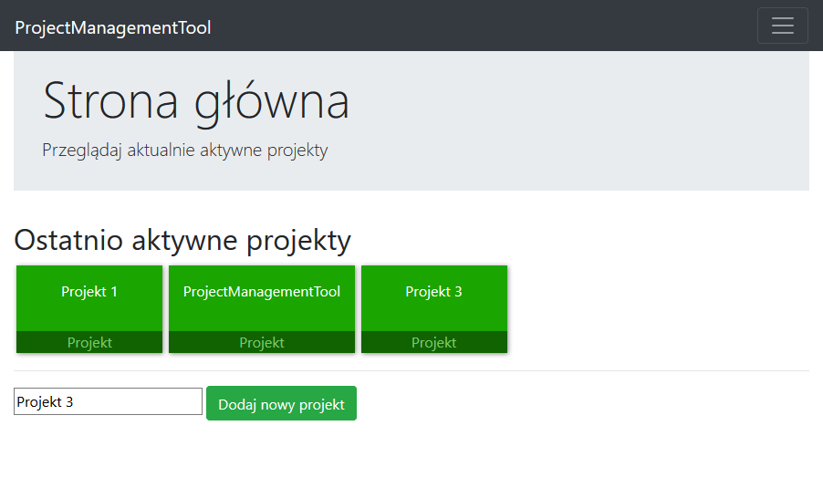
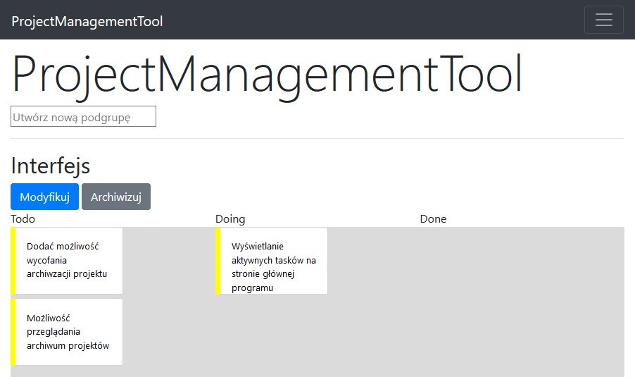

# TaskManager
(university project) (not under development)

App for creating to-do tasks (similar to Trello), that was focusing on management of programming projects.

App is created from two separate apps (.NET Core backend and Angular frontend). 

## Requirements:
* [.NET Core runtime](https://dotnet.microsoft.com/download)
* [Node.JS](https://nodejs.org/en/)
* [Angular CLI](https://cli.angular.io/)

## How to start project:

* To run backend part, open ProjectManagementTool.sln in Visual Studio or go into ProjectManagementTool folder and type `dotnet run`.

* Frontend part requires Node.JS and Angular CLI (`npm install -g @angular/cli`). Run by typing `ng serve`.

## Screenshots:

Main page:

Page with tasks of chosen project:

